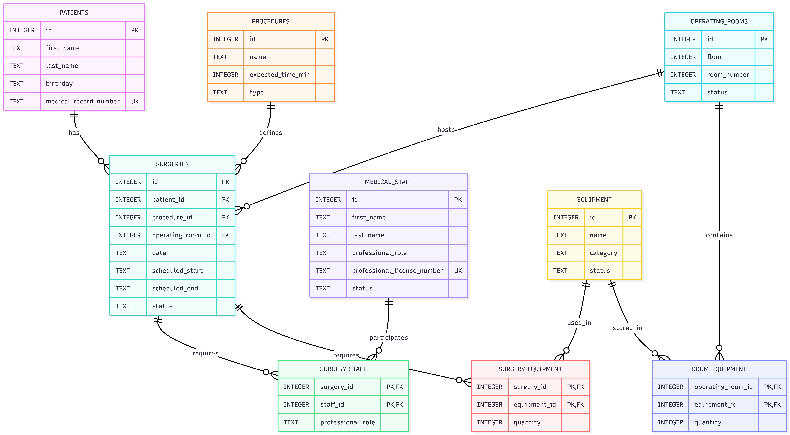

# Design Document

By BARBARA BARLETTA CORNETTI DA SILVA

Video overview: <URL HERE>

## Scope

The purpose of ORMS (Operating Room Management System) is to manage the scheduling and resources of operating rooms in a hospital. The idea for this project was inspired by *Grey's Anatomy*, where doctors, surgeons, and nurses use a whiteboard to follow the surgeries scheduled for each day. ORMS represents a database-driven version of this idea, replacing the manual whiteboard with a structured relational database.

The database includes the main information needed to manage operating room activities:

* **Patients**, including their names, date of birth, and medical record number.
* **Procedures**, including their name, type, and expected duration.
* **Operating rooms**, including their floor, room number, and current status.
* **Medical staff**, including their names, professional roles, license numbers, and employment status.
* **Equipment**, including its name, category, and current status.
* **Surgeries**, including the patient, procedure, operating room, scheduled date and time, and status.
* **Surgery staff assignments**, which represent the medical staff members involved in each surgery and their role in that surgery.
* **Surgery equipment**, which represents the equipment required for each surgery and the required quantity.
* **Room equipment**, which represents the equipment available in each operating room and its quantity.

The database also includes information and logic for checking operating room availability, identifying scheduling conflicts, managing staff assignments, and analyzing room utilization.

The scope of the database does not include the complete medical history of patients, clinical notes, diagnoses, prescriptions, laboratory results, billing, insurance information, hospital admissions, or other general hospital management activities. ORMS focuses specifically on operating room scheduling and the resources needed to perform surgeries.

## Functional Requirements

A user should be able to use the database to manage and monitor the operating room schedule and the resources required for surgeries.

The database should allow users to:

* Add and manage patient records.
* Add and manage surgical procedures and their expected duration.
* Add and manage operating rooms and their current status.
* Add and manage medical staff and their professional information.
* Add and manage hospital equipment.
* Schedule surgeries for specific patients, procedures, operating rooms, dates, and times.
* Assign medical staff members to surgeries and record their role in each surgery.
* Record the equipment required for each surgery and the required quantity.
* Record which equipment is available in each operating room and its quantity.
* View the daily surgical schedule by operating room.
* Find the next scheduled surgery for each operating room.
* View the schedule of a specific medical staff member.
* Identify overlapping surgeries scheduled in the same operating room.
* Identify medical staff members assigned to overlapping surgeries.
* Check whether an operating room has the equipment required for a surgery.
* View operating room utilization, including the number of surgeries and total scheduled time.
* Filter surgeries by status, patient, staff member, operating room, or date.
* Analyze completed and cancelled surgeries.

The database also uses triggers to prevent some scheduling conflicts. For example, a surgery cannot be assigned to an operating room if it overlaps with another scheduled surgery in the same room, and a staff member cannot be assigned to overlapping surgeries.

### Outside the Functional Scope

The database is not intended to replace a complete hospital information system. Users should not expect it to manage:

* Patient medical histories or clinical records.
* Diagnoses, prescriptions, or treatment plans.
* Laboratory or imaging results.
* Billing, payments, or insurance claims.
* Hospital admissions or patient discharge processes.
* Staff payroll, salaries, or human resources management.
* Detailed equipment maintenance records.
* Real-time monitoring of patients or medical equipment.
* Automatic optimization of the surgical schedule.

The main purpose of ORMS is to organize operating room schedules and coordinate the patients, procedures, medical staff, and equipment involved in surgeries.

## Representation

### Entities

The database contains six main entities: `patients`, `procedures`, `operating_rooms`, `medical_staff`, `equipment`, and `surgeries`. Three junction tables, `surgery_staff`, `surgery_equipment`, and `room_equipment`, are used to represent many-to-many relationships.

#### Patients

The `patients` table stores the basic information needed to identify a patient.

* `id` — `INTEGER`, used as the primary key.
* `first_name` — `TEXT`, because names are stored as text.
* `last_name` — `TEXT`, because names are stored as text.
* `birthday` — `TEXT`, stored using the `YYYY-MM-DD` format.
* `medical_record_number` — `TEXT`, because the medical record number can contain letters and numbers.

The `medical_record_number` is `UNIQUE` because each patient must have a different medical record number. The required fields use `NOT NULL`.

#### Procedures

The `procedures` table stores the hospital's catalog of procedures.

* `id` — `INTEGER`, used as the primary key.
* `name` — `TEXT`, because procedure names are text.
* `expected_time_min` — `NUMERIC`, because the expected duration is a numerical value representing minutes.
* `procedure_type` — `TEXT`, because the procedure type is stored as a category.

A `CHECK` constraint limits procedure types to `Emergency`, `Elective`, and `Diagnostic`.

#### Operating Rooms

The `operating_rooms` table stores information about the hospital's operating rooms.

* `id` — `INTEGER`, used as the primary key.
* `floor` — `INTEGER`, because the floor is represented by a number.
* `room_number` — `INTEGER`, because the room number is represented by a number.
* `status` — `TEXT`, because the room status is a descriptive value.

The combination of `floor` and `room_number` is `UNIQUE`. This allows the same room number to exist on different floors while preventing two records from representing the same physical room.

A `CHECK` constraint limits room statuses to `Available`, `In Surgery`, `Maintenance`, and `Out of Service`.

#### Medical Staff

The `medical_staff` table stores the professionals who can participate in surgeries.

* `id` — `INTEGER`, used as the primary key.
* `first_name` — `TEXT`.
* `last_name` — `TEXT`.
* `professional_role` — `TEXT`.
* `professional_license_number` — `TEXT`.
* `status` — `TEXT`.

The professional license number is `UNIQUE` because it identifies a professional within the hospital's records.

The staff status is also restricted using a `CHECK` constraint to `Active`, `Inactive`, `On Leave`, and `Terminated`.

#### Equipment

The `equipment` table stores the equipment that can be available in operating rooms or required for surgeries.

* `id` — `INTEGER`, used as the primary key.
* `name` — `TEXT`.
* `category` — `TEXT`.
* `status` — `TEXT`.

The equipment status is restricted to `Available`, `In Use`, `Maintenance`, and `Out of Service`.

#### Surgeries

The `surgeries` table is the central entity of the database.

* `id` — `INTEGER`, used as the primary key.
* `patient_id` — `INTEGER`, referencing `patients`.
* `procedure_id` — `INTEGER`, referencing `procedures`.
* `operating_room_id` — `INTEGER`, referencing `operating_rooms`.
* `date` — `TEXT`, stored using the `YYYY-MM-DD` format.
* `scheduled_start` — `TEXT`, storing the scheduled date and time in a consistent SQLite-compatible format.
* `scheduled_end` — `TEXT`, storing the scheduled date and time in the same format.
* `status` — `TEXT`, representing the current status of the surgery.

Foreign keys are used to make sure that every surgery is associated with an existing patient, procedure, and operating room.

The surgery status is restricted to `Scheduled`, `In Progress`, `Completed`, and `Cancelled`.

SQLite does not have a separate `DATETIME` storage class. For this reason, dates and times are stored as `TEXT` using consistent date and time formats. This also allows SQLite date and time functions, such as `julianday()`, to be used in queries.

### Relationships

The entity relationship diagram below shows the relationships between the main entities and junction tables.

A patient can have many surgeries, while each surgery belongs to one patient. A procedure can also be associated with many surgeries, while each surgery references one procedure.

An operating room can host many surgeries over time, but each surgery is assigned to one operating room.

The relationship between `surgeries` and `medical_staff` is many-to-many. A surgery can have multiple staff members, and a staff member can participate in multiple surgeries. This relationship is represented by the `surgery_staff` junction table, which also stores the professional's role in that specific surgery.

The relationship between `surgeries` and `equipment` is also many-to-many. A surgery can require multiple types of equipment, and the same equipment type can be required by many surgeries. The `surgery_equipment` table stores the required quantity.

Finally, `operating_rooms` and `equipment` have a many-to-many relationship. An operating room can contain different types of equipment, and the same type of equipment can be available in multiple rooms. The `room_equipment` table stores the quantity available in each room.

Foreign keys are used throughout these relationships to maintain referential integrity.

## Optimizations

Several indexes were created to improve queries that are expected to be used frequently.

Indexes were created on patient and medical staff names to make name-based searches faster. An index was also created on the medical staff status to help filter staff members by their current employment status.

The `surgeries` table has indexes on `date`, `operating_room_id`, `patient_id`, and `status`. These indexes support common operations such as finding surgeries for a specific date, room, patient, or status.

Indexes were also created on `staff_id` in `surgery_staff`, `equipment_id` in `surgery_equipment`, and `equipment_id` in `room_equipment`. These indexes help find surgeries involving a specific staff member or equipment and identify the rooms where a specific type of equipment is available.

The database also includes views to simplify common operations:

* `surgical_schedule` provides a database-driven version of the hospital's daily surgical schedule.
* `operating_room_status` shows the current room status and the next scheduled surgery.
* `room_utilization` provides information about the number of surgeries and total scheduled time for each room.
* `staff_schedule` shows the surgeries assigned to each medical staff member.

Triggers were also used to prevent scheduling conflicts. One trigger prevents overlapping surgeries from being scheduled in the same operating room, while another prevents a staff member from being assigned to overlapping surgeries.

## Limitations

This database focuses on operating room scheduling and resource coordination, so it does not represent all the information that would normally exist in a real hospital system.

Patient information is intentionally limited to basic identification data. The database does not store medical history, diagnoses, medications, laboratory results, or clinical notes.

The equipment model also represents equipment types and quantities rather than individual physical devices. For example, if a room has three cardiac monitors, the database records the quantity but does not identify each monitor individually or track its serial number.

The scheduling system can identify overlapping surgeries and staff assignments, but it does not automatically create the best possible schedule for the hospital. A real hospital may also need to consider staff qualifications, emergency cases, recovery times, room cleaning, equipment availability in real time, and other operational constraints.

The database also does not provide a user interface. Users would need another application or database client to interact with the data.

Finally, dates and times are stored as `TEXT` because SQLite does not have a dedicated `DATETIME` type. The design therefore depends on using a consistent date and time format when inserting data.

